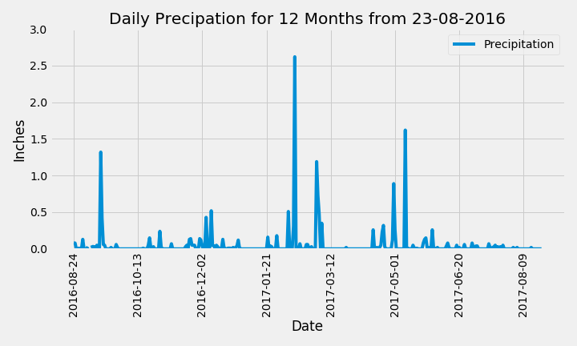
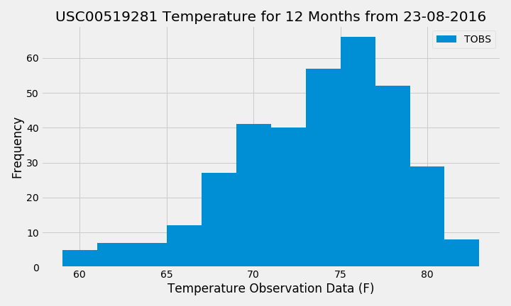
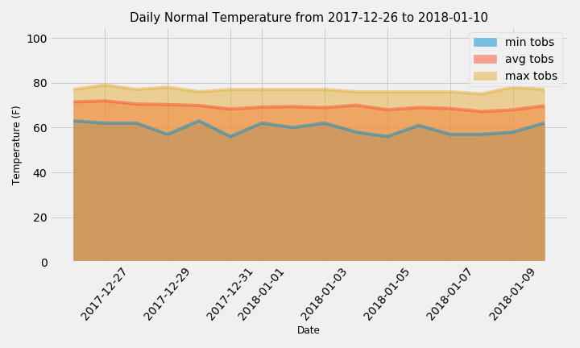

# sqlalchemy-challenge
 Jamie Tan SQL Alchemy challenge submission

### Background of the challenge
We were required to perform a climate analysis to help plan my vacation in Honolulu, Hawaii! :airplane::surfing_woman: This is quite a tease as we enter stage 4 lockdown today... but I digress. We were supplied with some weather data and station data for Hawaii in csv and sqlite formats. There are 2 main objectives:

1. Data analysis and data exploration using Python, SQL Alchemy, Pandas and Matplotlib
2. Design an app using Flask API

### Climate Analysis and Exploration

**1. Precipitation Analysis**

I would avoid going for my Hawaii holiday on February, March, May and September :cloud_with_rain:

**2. Station Analysis**

There is a total of 9 weather stations in Honolulu, Hawaii. There most active station is USC00519281 at the Manoa Lyon Arboretum. Mental note to pack my rain poncho and waterproof boots if I'll be hiking there. :mosquito:

Temperature Observation Data for station USC00519281 | 
------------ | 
Lowest temperature recorded: 54.0 F | 
Highest temperature recorded: 85.0 F | 
Average temperature recorded: 71.7 F |

The average temperature seems lovely - but is that what I should be expecting? Let's check the temperature frequency histogram.

The mode in that area is approximately 76 F which is beautiful! From the shape, we can also determine that it is skewed to the right - a good direction to be leaning towards. :rainbow:

**3. Temperature Analysis - June or December?**

Comparing the average temperature at all stations across all years, we find that June is the warmer month at 74.9 F vs. 71.0 F in December. It is not a significant difference.

**4. Temperature Analysis - Previous Years' Minimumum, Average and Maximum Temperature of Proposed Holiday Period**

Since there is not a material difference in temperature between June and December, I am keen to take advantage of the public holidays in December/January. I am tentatively interested in a 15 days holiday from 26 December to 10 January.

Temperature analysis of proposed vacation dates (same dates last year) |
------------ | 
Minimum temperature during the period: 60.0 F | 
Maximum temperature during the period: 77.0 F | 
Average temperature during the period: 69.3 F |

**5. Rainfall Average by Weather Station**

The Manoa Lyon Arboretum is still the wettest station 12 months prior to my proposed vacation period with an average rainfall of 6.69 inches. The other stations are not nearly as wet with average rainfall ranging between 0 to 1.87 inches during the same period. Tourists beware! ..pack wisely. :umbrella:

**6. Daily Normal Temperature**

During my proposed holiday period, the daily normal temperature looks pretty consistent. :thermometer: Ah, the tropics! I can only dream :butterfly::crossed_fingers:

### Flask API - Climate App

Besides the homepage, the following 5 endpoints have also been created with Flask:

**/api/v1.0/precipitation**
- Format: JSON. Precipitation levels (in inches) by date for 12 months from 2016-08-23

**/api/v1.0/stations**
- Format: JSON. List of weather stations

**/api/v1.0/tobs**
- Format: JSON. List of temperature observations (TOBS) (in fahrenheit) for the most active station for 12 months from 2016-08-23

**/api/v1.0/&lt;start&gt;**
- Input start date in YYYY-MM-DD
- Format: JSON. List of minimum temperature, average temperature and maximum temperature from a given period

**/api/v1.0/&lt;start&gt;/&lt;end&gt;**
- Input start date and end date in YYYY-MM-DD
- Format: JSON. List of minimum temperature, average temperature and maximum temperature between the given start and end dates (inclusive)

### Files:

**1. Climate Analysis**
* Jupyter Notebook (filename: climate_analysis.ipynb)
   
**2. Flask API**
* Python (filename: app.py)
